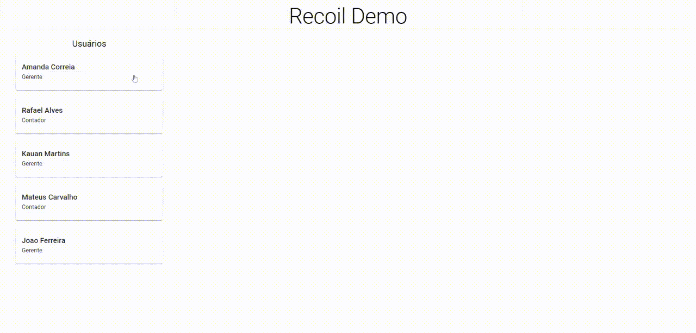
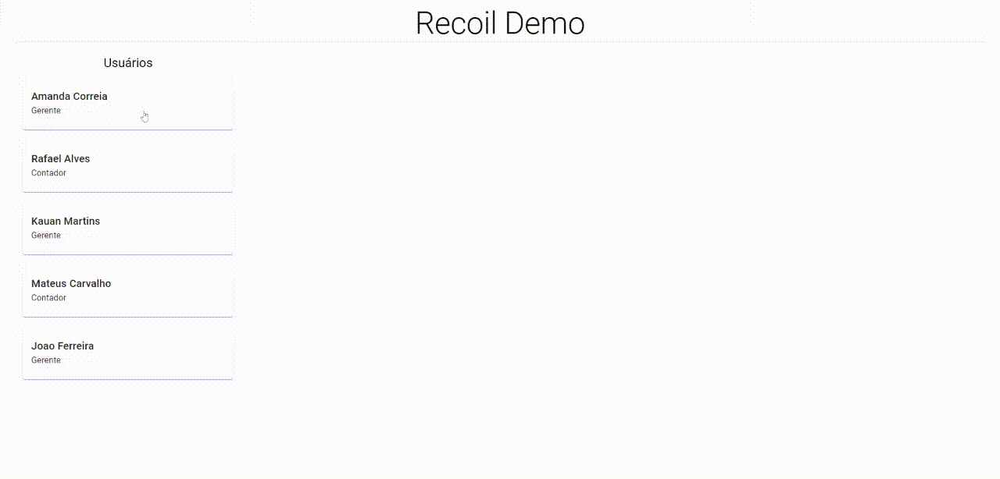
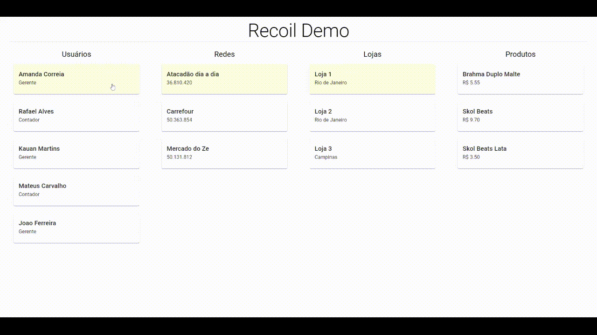

# RecoilJS na Prática

RecoilJS é mais uma biblioteca de gerenciamento de estado do React (sim, mais uma!). Ela vem sendo desenvolvida pela equipe do Facebook e tem chamado muita atenção da comunidade. Além de conseguir fazer praticamente tudo que as outras bibliotecas fazem, ela também tem compatibilidade com funcionalidades mais recentes, como o Suspense e o *Concurrent mode*. Suas três características mais relevantes são:

- Sintaxe e estrutura similiares ao React;

- Fluxo de dados derivados e assíncronos controlados por funções puras e *subscriptions* eficientes;

- Capacidade de fazer observações entre múltiplos apps e debugar sem prejudicar o *code-splitting*.


Para melhor entendimento do poder dessa ferramenta, preparei uma pequena aplicação para apresentação de alguns conceitos do RecoilJS.


Essa aplicação é um gerenciador de usuários, redes, lojas e produtos, sendo que uma rede pode ter mais de um usuário associado, e produtos possuem preços diferentes entre as lojas. Ao clicar em um card, a próxima coluna é carregada com base na entidade selecionada, e enquanto a request está sendo carregada, um *Skeleton* aparece no lugar. Todas as edições realizadas em qualquer entidade abaixo de usuário refletem para todos os outros. Esse fluxo está sendo realizado com base no Recoil.


#### Definições

------

Antes de entrarmos em detalhes de código, vamos ver alguns conceitos básicos do Recoil.


- [**Atoms**](https://recoiljs.org/docs/api-reference/core/atom)  Similar ao estado do React, um atom tem a capacidade de armazenar qualquer tipo válido de dado (objetos, strings, arrays, numbers etc.). Para acessar o valor do atom em qualquer lugar da aplicação, basta usar o Hook [**useRecoilState**](https://recoiljs.org/docs/api-reference/core/useRecoilState), bem parecido com o useState() do React.
- [**Selectors**](https://recoiljs.org/docs/api-reference/core/selector)  Um selector seleciona um estado existente da aplicação, pode ser de um atom ou de outro selector e pode ser usado para realizar alguma modificação ao estado antes de ser acessado. O selector funciona com um “memoizer”, por exemplo, ele deixa o valor em cache correspondendo ao input, então se você fizer duas requisições à um selector sem alterar o input dele, ele retornará o valor em cache, ao invés de realizar a função novamente.
- [**RecoilRoot**](https://recoiljs.org/docs/api-reference/core/RecoilRoot) - Bem similar ao Provider do Context API, o RecoilRoot precisa ser o pai de todo componente que utilizar os hooks do Recoil.


Fique tranquilo se ainda parece um pouco abstrato, conforme avançarmos no código, ficará tudo mais claro.

####  Implementação

------

Primeiramente, vamos criar um **atom** para armazenar a lista de usuários.


```react
const usersQuery = async () => {
  const { data } = await getUsers();
  return data;
};

export const usersAtom = atom<Array<User>>({
  key: 'usersAtom',
  default: usersQuery(),
});
```


Bom, vamos lá... O que aconteceu aqui? Primeiro criamos uma função para carregar os dados de usuário da API, e passamos o retorno desta como valor inicial do atom. Simples, certo?

Para visualização dos usuários na tela foi criado este componente abstrato:


```react
interface CardColumnProps<T extends BaseEntity> {
    recoilSelector: RecoilValue<Array<T>>
    children: (item: T) => ReactNode,
    title: string,
}

function ListContainer<T extends BaseEntity>({
  recoilSelector,
  children,
  title,
}: CardColumnProps<T>): ReactElement | null {
  const list = useRecoilValue(recoilSelector);

  if (list.length === 0) return null;

  return (
    <>
      <Grid xs={12} item>
        <Typography align="center" variant="h5">{title}</Typography>
      </Grid>
      <Grid xs={12} container item spacing={3}>
        {list.map((item) => (
          <Grid key={item.id} item xs={12}>
            { children(item) }
          </Grid>
        ))}
      </Grid>
    </>
  );
}
```


O recoilSelector aqui é um atom ou selector do Recoil que armazena uma lista de entidades e a children passada é uma função chamada para todo elemento da lista.

O Hook [useRecoilValue](https://recoiljs.org/docs/api-reference/core/useRecoilValue) retorna o valor atual do recoilSelector, que nesse caso, será um Array de User.

Um dos pontos interessantes do Recoil, é que ele usa funcionalidades mais novas do React, como o Suspense para queries assíncronas. Já que nosso Atom de usuários é inicialmente uma Promise, podemos fazer proveito dessa funcionalidade, como feito aqui:


```react
function CardList<T extends BaseEntity>({
  title,
  recoilSelector,
  children,
}: CardColumnProps<T>): ReactElement {
  return (
    <Grid justify="center" container spacing={2}>
      <Suspense fallback={<LoadingList />}>
        <ListContainer recoilSelector={recoilSelector} title={title}>
          {(item) => children(item)}
        </ListContainer>
      </Suspense>
    </Grid>
  );
}
```


Esse componente funciona apenas para englobar o componente que faz uma requisição assíncrona com o Suspense, para mostrar um *loading* enquanto carrega a requisição. Por fim, podemos instanciar a coluna de usuários dessa forma:


```react
const UserColumn: FunctionComponent = () => (
  <CardList title="Usuários" recoilSelector={usersAtom}>
    {(user) => (
      <Card>
        <Typography variant="h6">{`${user.name} ${user.lastName}`}</Typography>
        <Typography>{user.role}</Typography>
      </Card>
    )}
  </CardList>
);
```


O resultado disso tudo:


Incrível, né? E ainda nem chegamos na parte mais divertida. Agora vamos renderizar a coluna de redes do usuário. Para isso, vamos ter que implementar uma função que, ao clicar em um Card armazenará o usuário selecionado, no estado da aplicação. Para isso, criaremos um atom para armazenar o usuário, como esse abaixo:


```react
export const currentUser = atom<User | null>({
  key: 'currentUser',
  default: null,
});
```


E atualizando nosso componente, podemos fazer dessa maneira:


```react
const UserColumn: FunctionComponent = () => {
  const setUser = useSetRecoilState(currentUser);
  return (
      <CardList title="Usuários" recoilSelector={usersAtom}>
        {(user) => (
          <CustomCard onClick={() => setUser(user)}>
            <Typography variant="h6">{`${user.name} ${user.lastName}`}</Typography>
            <Typography>{user.role}</Typography>
          </CustomCard>
        )}
      </CardList>
  );
};
```


O Hook [useSetRecoilState](https://recoiljs.org/docs/api-reference/core/useSetRecoilState) retorna um setter para o estado, sem sobrescrever o componente ao valor do atom; assim, ele não renderiza o componente novamente quando o estado for alterado.

Porém, temos um problema aqui, como saberemos visualmente qual usuário está selecionado? Existem algumas formas de resolver isso, e apresentarei uma maneira usando um selector bidirecional do recoil. Um selector bidirecional é nada mais que um selector que implementa o método de get e set. Nesse nosso exemplo, ele vai ter essa forma:


```react
export const currentUserState = selector<User | null>({
  key: 'currentUserState',
  get: ({ get }) => get(currentUser),
  set: ({ set, reset }, newValue) => {
    if (newValue instanceof DefaultValue) {
      return reset(currentUser);
    }
    if (newValue) {
      set(usersAtom, (users) => users.map((u) => ({ ...u, selected: u.id === newValue.id })));
    }
    return set(currentUser, newValue);
  },
});
```


O get dele retorna apenas o valor do usuário selecionado armazenado no atom, a mágica acontece no set. A função set, recebe como parâmetro o conjunto de operações do recoil (get, set, reset) e o novo valor passado. Esse novo valor pode ser do tipo DefaultValue, caso esteja resetando o valor desse selector (Veja o Hook [useResetRecoilState](https://recoiljs.org/docs/api-reference/core/useResetRecoilState)). No código acima, temos a primeira condição que caso seja um reset do selector, resetamos também o valor do atom. Caso o valor não seja nulo, fazemos um map na lista de usuários e marcamos como selecionado aquele que tem o mesmo id que o novo usuário selecionado. Por fim, setamos o valor do atom o novo valor passado. Por fim, atualizamos o componente da listagem de usuários:


```react
const UserColumn: FunctionComponent = () => {
  const setUser = useSetRecoilState(currentUserState);
  return (
      <CardList title="Usuários" recoilSelector={usersAtom}>
        {(user) => (
          <CustomCard onClick={() => setUser(user)} selected={user.selected}>
            <Typography variant="h6">{`${user.name} ${user.lastName}`}</Typography>
            <Typography>{user.role}</Typography>
          </CustomCard>
        )}
      </CardList>
  );
};
```


Ótimo, já estamos conseguindo salvar o estado do nosso usuário selecionado e visualizar qual usuário foi selecionado. Agora vamos implementar os estados das redes. No caso dos usuários nós apenas precisamos de um atom, agora, porém, teremos uma pequena mudança.


```react
const chainsQuery = async (userId: number): Array<Chain> => {
  const { data } = await getChainsByUser(userId);
  return data;
};

export const chainsAtom = atomFamily<Array<Chain>, number>({
  key: 'chainsAtom',
  default: (userId: number) => chainsQuery(userId),
});
```


Aqui, somos introduzidos a ideia de família. Um [atomFamily](https://recoiljs.org/docs/api-reference/utils/atomFamily) é essencialmente um mapa de chave-valor, sendo a chave o parâmetro passado. Dessa maneira, conseguimos mapear e salvar no estado da aplicação, as redes de todos os usuários que passarmos como parâmetro em apenas uma função, legal né? A questão agora é que, para usar esse atom, será necessário sempre passar um parâmetro. Para facilitar a chamada dele, criaremos um selector que já pega o valor do id usuário selecionado, e passa como parâmetro para o atom de redes.

Antes de criar esse selector, criaremos outro para facilitar a query, que tem como função recuperar o id do usuário selecionado.


```react
export const currentUserId = selector<number | null>({
  key: 'currentUserId',
  get: ({ get }) => {
    const user = get(currentUserState);
    if (!user) return null;
    return user.id;
  },
});
```


E agora criamos o selector de redes e o componente que irá renderizar as redes.


```react
export const chainsState = selector<Array<Chain>>({
  key: 'chainsState',
  get: ({ get }) => {
    const userId = get(currentUserId);
    if (!userId) return [];
    return get(chainsAtom(userId));
  },
  set: ({ set, get }, newValue) => {
    const userId = get(currentUserId);
    if (!userId) throw new Error('User id is missing');
    set(chainsAtom(userId), newValue);
  },
});

const ChainColumn: FunctionComponent = () => (
  <CardList title="Redes" recoilSelector={chainsState}>
    {(chain) => (
      <CustomCard
        selected={chain.selected}
      >
        <Typography variant="h6">{`${chain.name}`}</Typography>
        <Typography>{chain.identification}</Typography>
      </CustomCard>
    )}
  </CardList>
);

```


O selector retornará um array vazio quando não existir usuário selecionado. Caso contrário, retornará a query de redes com base no id do usuário. Além disso, foi implementada função set para esse selector, a qual lançará um erro na ausência de usuário. Caso o usuário seja identificado o estado da query de redes será modificado. E agora, podemos visualizar tudo isso em funcionamento:


Repare que para cada usuário as redes são carregadas apenas uma vez, isso é graças ao atomFamily, pois o recoil armazenou para cada id de usuário, as respectivas redes.

Agora ficou simples para implementar a coluna de lojas, podemos seguir o mesmo exemplo do usuário e criar um atom para a rede selecionada.


```react
export const currentChain = atomFamily<Chain | null, number>({
  key: 'currentChain',
  default: null,
});

export const currentChainState = selector<Chain | null>({
  key: 'currentChainState',
  get: ({ get }) => {
    const userId = get(currentUserId);
    if (!userId) return null;

    return get(currentChain(userId));
  },
  set: ({ reset, set, get }, newValue) => {
    const userId = get(currentUserId);
    if (!userId) throw new Error('User id is missing');

    if (newValue instanceof DefaultValue) {
      return reset(currentChain(userId));
    }

    if (newValue) {
      set(chainsState, (chains) => chains.map((c) => ({ ...c, selected: c.id === newValue.id })));
    }

    return set(currentChain(userId), newValue);
  },
});
```


Bem similar ao atom *currentUser*, porém usando um atomFamily, garantimos que cada usuário possuirá uma rede selecionada salva no estado da aplicação. Dessa maneira, atualizamos o componente para que mostre visualmente qual rede está selecionada e a salve no atom.


```react
const ChainColumn: FunctionComponent = () => {
  const setChain = useSetRecoilState(currentChainState);

  return (
      <CardList title="Redes" recoilSelector={chainsState}>
        {(chain) => (
          <CustomCard
            selected={chain.selected}
            onClick={() => setChain(chain)}
          >
            <Typography variant="h6">{`${chain.name}`}</Typography>
            <Typography>{chain.identification}</Typography>
          </CustomCard>
        )}
      </CardList>
  );
};
```


O resultado dessas modificações:





Viu como mesmo mudando de usuário, a rede selecionada permanece? Tudo isso graças ao Recoil e o **atomFamily**.

Fazer a implementação agora da coluna de lojas ficou fácil, podemos nos basear no código da listagem de redes e alterar alguns valores.

Atoms e selectors:


```react
const storesQuery = async (chainId: number): Promise<Array<Store>>  => {
  const { data } = await getStoresByChain(chainId);
  return data;
};

export const storesAtom = atomFamily<Array<Store>, number>({
  key: 'storesAtom',
  default: (chainId) => storesQuery(chainId),
});

export const storesState = selector<Array<Store>>({
  key: 'storesState',
  get: ({ get }) => {
    const chainId = get(currentChainId);
    if (!chainId) return [];
    return get(storesAtom(chainId));
  },
  set: ({ set, get }, newValue) => {
    const chainId = get(currentChainId);
    if (!chainId) throw new Error('Chain id is missing');
    set(storesAtom(chainId), newValue);
  },
});

const currentStore = atomFamily<Store | null, number>({
  key: 'currentStore',
  default: null,
});

export const currentStoreState = selector<Store | null>({
  key: 'currentStoreState',
  get: ({ get }) => {
    const chainId = get(currentChainId);
    if (!chainId) return null;

    return get(currentStore(chainId));
  },
  set: ({ set, get, reset }, newValue) => {
    const chainId = get(currentChainId);
    if (!chainId) throw new Error('Chain id is missing');

    if (newValue instanceof DefaultValue) {
      return reset(currentStore(chainId));
    }

    if (newValue) {
      set(storesState, (stores) => stores.map((s) => ({ ...s, selected: s.id === newValue.id })));
    }

    return set(currentStore(chainId), newValue);
  },
});
```


Componente da coluna:


```react
const StoreColumn: FunctionComponent = () => {
  const setStore = useSetRecoilState(currentStoreState);
  return (
      <CardList title="Lojas" recoilSelector={storesState}>
        {(store) => (
          <CustomCard
            selected={store.selected}
            onClick={() => setStore(store)}
          >
            <Typography variant="h6">{`${store.name}`}</Typography>
            <Typography>{store.city}</Typography>
          </CustomCard>
        )}
      </CardList>
  );
};
```


E então temos esse resultado agora:


Hmm, parece que temos um problema aqui. Quando mudamos de usuários que compartilham a mesma rede, a loja que selecionamos no primeiro usuário continua selecionada quando vamos ao segundo. Podemos consertar esse problema passando para o atomFamily de loja selecionada o id do usuário também, dessa maneira, os valores de loja selecionada teriam duas chaves e só mostraria que está selecionado para aquele usuário e para aquela rede específica. Segue a implementação:


```react
interface StoreStateProps {
  chainId: number,
  userId: number,
}

const currentStore = atomFamily<Store | null, Readonly<StoreStateProps>>({
  key: 'currentStore',
  default: null,
});

export const currentStoreState = selector<Store | null>({
  key: 'currentStoreState',
  get: ({ get }) => {
    const chainId = get(currentChainId);
    if (!chainId) return null;

    const userId = get(currentUserId);
    if (!userId) return null;

    return get(currentStore({ chainId, userId }));
  },
  set: ({ set, get, reset }, newValue) => {
    const chainId = get(currentChainId);
    if (!chainId) throw new Error('Chain id is missing');

    const userId = get(currentUserId);
    if (!userId) throw new Error('User id is missing');

    const params = { chainId, userId };

    if (newValue instanceof DefaultValue) {
      return reset(currentStore(params));
    }

    if (newValue) {
      set(storesState, (stores) => stores.map((s) => ({ ...s, selected: s.id === newValue.id })));
    }

    return set(currentStore(params), newValue);
  },
});
```


Reparem que, para passar mais de um parâmetro para um atomFamily, é necessário que este parâmetro seja um objeto imutável, por isso criamos uma interface com as propriedades que desejamos, e ainda usamos o tipo **[Readonly](https://www.tutorialsteacher.com/typescript/typescript-readonly)**. Porém, nossa aplicação ainda não está funcionando como desejamos, precisamos alterar o atom da lista para receber como parâmetro o id do usuário e o da rede.


```react
const storesQuery = selectorFamily<Array<Store>, number>({
  key: 'storesQuery',
  get: (chainId) => async () => {
    const { data } = await getStoresByChain(chainId);
    return data;
  },
});

export const storesAtom = atomFamily<Array<Store>, Readonly<StoreStateProps>>({
  key: 'storesAtom',
  default: ({ chainId }) => storesQuery(chainId),
});

export const storesState = selector<Array<Store>>({
  key: 'storesState',
  get: ({ get }) => {
    const userId = get(currentUserId);
    if (!userId) return [];

    const chainId = get(currentChainId);
    if (!chainId) return [];
    return get(storesAtom({ chainId, userId }));
  },
  set: ({ set, get }, newValue) => {
    const userId = get(currentUserId);
    if (!userId) throw new Error('User id is missing');

    const chainId = get(currentChainId);
    if (!chainId) throw new Error('Chain id is missing');

    set(storesAtom({ chainId, userId }), newValue);
  },
});
```


Bem similar ao atom da loja selecionada, aqui também adicionamos a dependência ao id do usuário. Outra modificação também necessária foi usar um [selectorFamily](https://recoiljs.org/docs/api-reference/utils/selectorFamily) para fazer a query de lojas. Foi implementado desta forma para que a requisição seja executada apenas na alteração da rede selecionada, e não na alteração da seleção de usuário e rede, possibilitando a otimização da velocidade da aplicação.


Vamos ver o resultado:


Perfeito! Agora temos 3 colunas funcionando como desejado, então por fim, vamos à implementação da última coluna, a de produtos. Essa coluna é a mais simples, pois não há a necessidade aqui de selecionarmos o produto, como nas outras colunas. Então vamos implementar apenas a listagem.


```react
const productsQuery = async (storeId: number): Promise<Array<Product>> => {
  const { data } = await getProductsByStore(storeId);
  return data;
};

export const productsAtom = atomFamily<Array<Product>, number>({
  key: 'productsAtom',
  default: (storeId) => productsQuery(storeId),
});

export const productsState = selector<Array<Product>>({
  key: 'productsState',
  get: ({ get }) => {
    const storeId = get(currentStoreId);
    if (!storeId) return [];
    return get(productsAtom(storeId));
  },
  set: ({ set, get }, newValue) => {
    const storeId = get(currentStoreId);
    if (!storeId) throw new Error('Store id is missing');
    set(productsAtom(storeId), newValue);
  },
});
```


Bem similar ao que já vimos anteriormente, apenas alterando alguns valores. E por fim, a implementação do componente:


```react
const ProductColumn: FunctionComponent = () => (
  <CardList title="Produtos" recoilSelector={productsState}>
    {(product) => (
      <CustomCard>
        <Typography variant="h6">{`${product.name}`}</Typography>
        <Typography>{formatMoney(product.price)}</Typography>
      </CustomCard>
    )}
  </CardList>
);
```


Juntando todas as colunas, temos nossa aplicação quase final:





Agora para a cereja do bolo, mostrarei como fazer a edição do estado:

```react
function useModalHelper<T extends BaseEntity>(selector: RecoilState<Array<T>>)
    :UseModalHelperReturn<T> {

  const updateList = useSetRecoilState(selector);

  const handleEdit = useCallback((values: T) => {
    updateList((items) => {
      const index = items.findIndex((p) => p.id === values.id);
      return [...items.slice(0, index), values, ...items.slice(index + 1)];
    });
  }, [updateList]);

  return {
    handleEdit,
  };
}
```


Foi implementado um hook customizado genérico para auxiliar na edição de qualquer selector bi-direcional ou atom. Demonstrando na prática, ficou algo assim:



Perceba como aquela simples implementação, foi capaz de refletir para todos os usuários que possuem acesso à loja. Tudo graças ao estado compartilhado dos produtos entre as lojas.


#### Conclusão

------

Ao final deste artigo é possível perceber a velocidade e a facilidade do Recoil em desenvolver atividades complexas. Por ser uma ferramenta de utilização relativamente simples, e ainda, por estar sendo desenvolvida por profissionais competentes, membros da equipe do Facebook, é recomendável que todo desenvolvedor React aprenda a trabalhar com ela. Na visão deste autor o Recoil vai ser o futuro do gerenciamento de estado no React.


Espero logo mais escrever uma continuação deste artigo mostrando como fazer edições mais complexas nos estados. Até logo!


Repositório da aplicação: [Recoil Demo](https://github.com/Gabrielgvl/recoil-demo-app)
